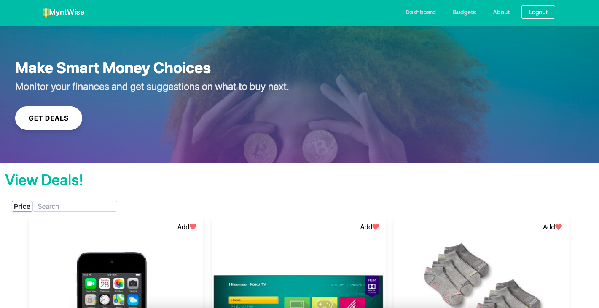
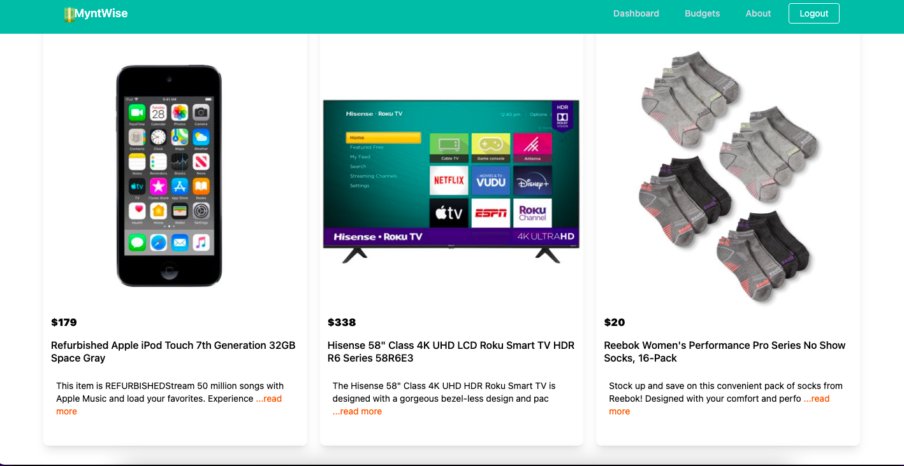
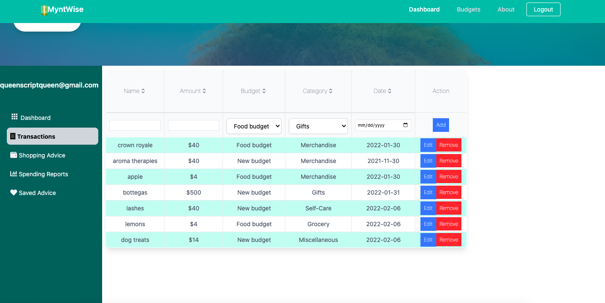
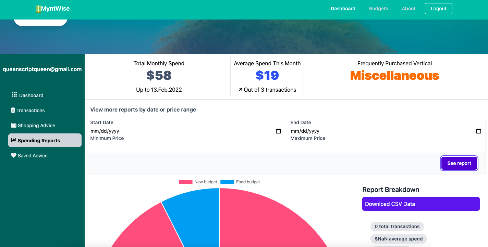

# MyntWise 
## Overview 
Build budgets, track transactions, and know where to purchase goods and services based on your financial availability and personal finance goals.
<a href="https://www.loom.com/share/20d84b32f918432f82594b17740a6cde">
    
  </a>
## Table of Contents 
## Installation
```
virtualenv env 
source env/bin/activate 
pip3 install -r requirements.txt
```
## Usage 
## Methodology
## License 
## Tech Stack
### Client 

* Tailwind CSS
* React / Hooks
    * React CSV

### Server

* PostGreSQL database
* Flask server
    * Celery 
    * SQLAlchemy
    * OAuth 
    * Google OAuth 
    * Walmart Affiliate Marketing API








## Contact
Created by Queen Shabazz during Walmart sponsored Hackbright residency. 